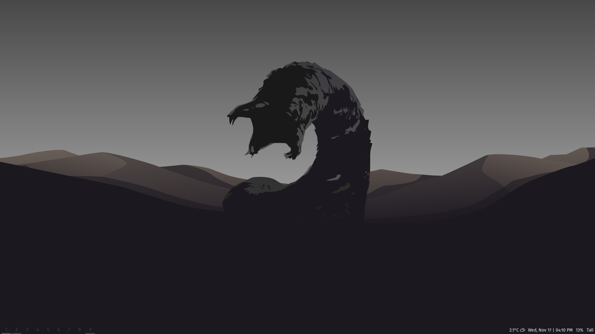
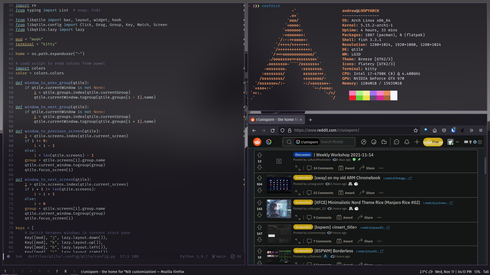
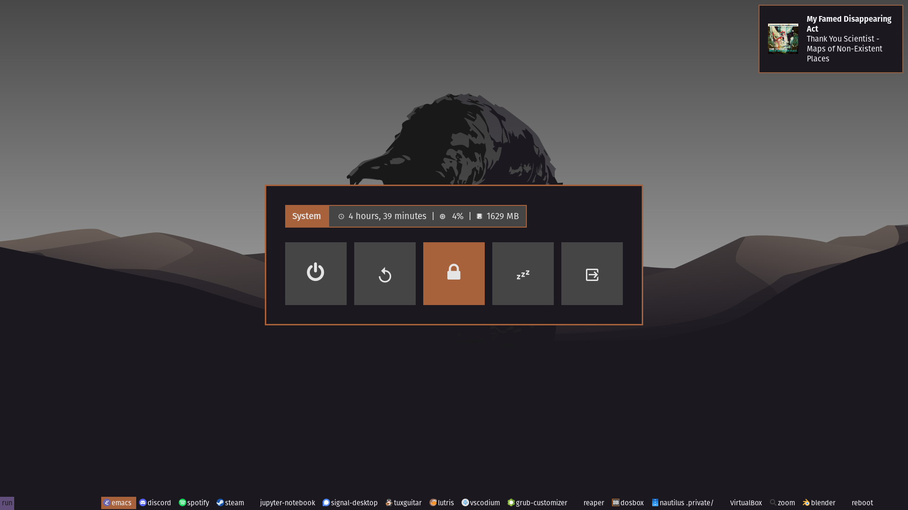

# Shai-Hulud - A qtile configuration for the (spice) masses

### Installation Notes
These dotfiles are set up to use GNU stow for installation. To install, first **MAKE SURE YOUR EXISTING CONFIG FILES ARE BACKED UP.** Once you have done that, make sure GNU Stow is installed on your system, then:
- Clone this repo somewhere on your drive
- cd into the cloned repo
- Enter the command (leave out folders you don't want):

~~~~
stow doom dunst kitty picom qtile rofi
~~~~

To use the OpenWeatherMap module in the bar, uncomment lines 274-278 of the qtile/config.py file, and add your location and OpenWeatherMap key.

### Apps Used
Desktop Environment |
---- |
Qtile |
Dunst |
Rofi |
[Ibhagwom's Picom](https://github.com/ibhagwan/picom) |
Feh |
Doom Emacs |

Command Line Interface |
---- |
Fish |
Kitty |

Rofi Menus (Included)|
---- |
[Rofi Applets - Power Menu](https://github.com/adi1090x/rofi) |
[DT's Rasi files](https://gitlab.com/dwt1/dotfiles/-/tree/master/.config/rofi/themes) |

Fonts |
---- |
Fira Sans |
FiraCode Nerd Font |

### Wallpaper
[I'm not sure who created this wallpaper, but it can be found here.](https://images.wallpapersden.com/image/download/dune-2020-cool-4k-minimalist_bGhqbWyUmZqaraWkpJRobWllrWdma2U.jpg)

## Other Configurations
Please note: these configuration files are no longer being updated.

[FluidTile for Qtile](https://github.com/NimbleClint/FluidTile)

[Adventure Time for i3-Gaps](https://github.com/NimbleClint/Adventure-Time-i3)
